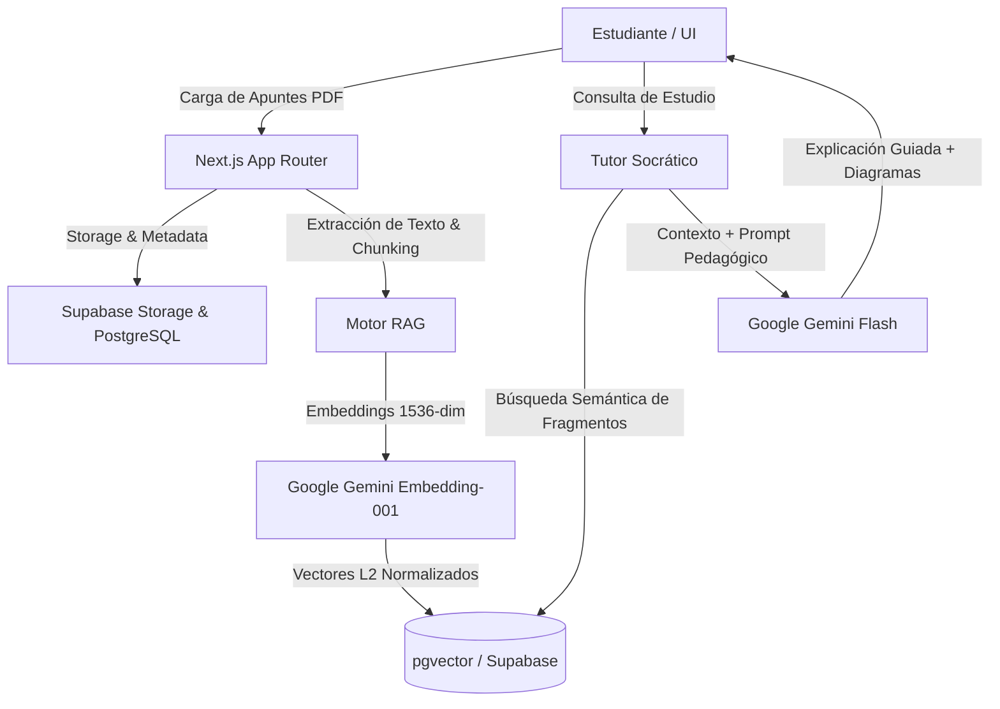

# 🎓 UniNav — Plataforma Inteligente de Acompañamiento Universitario

<p align="center">
  
  
  
  
  
  
</p>

<p align="center">
  <strong>Plataforma integral orientada a reducir la deserción universitaria de primer año en Argentina mediante Inteligencia Artificial y herramientas de estudio socrático.</strong>
</p>

<p align="center">
  🔗 <strong>Live Demo:</strong> <a href="https://uninav-rho.vercel.app">https://uninav-rho.vercel.app</a>
</p>

---

## 📌 ¿Qué es UniNav?

El primer año universitario presenta las tasas de abandono más elevadas en Argentina debido a la falta de orientación metodológica, la complejidad del material de estudio y la desorganización académica. 

**UniNav** aborda esta problemática combinando:
1. 🧠 **Tutor RAG Socrático:** No entrega la respuesta servida; guía al alumno mediante preguntas y pistas contextualizadas en sus propios apuntes.
2. 📚 **Gestión Vectorial de Apuntes (RAG):** Carga y procesamiento automático de PDFs con vectorización semántica (`pgvector` + `gemini-embedding-001`).
3. 🗺️ **Generador de Diagramas Conceptuales:** Renderizado en tiempo real de mapas mentales y flujos con Mermaid.js ($0 costo de cómputo).
4. 📅 **Planificador de Exámenes & Cronograma:** Panel interactivo para seguimiento de fechas de parciales y entregas.
5. 🛠️ **Curaduría de Herramientas por Carrera:** Directorio curado de software, simuladores y recursos específicos para cada disciplina.

---

## 🏗️ Arquitectura del Sistema



---

## ⚡ Tech Stack

- **Frontend & Routing:** Next.js 15 (App Router), React 19, TypeScript.
- **Styling:** Tailwind CSS v4 con diseño responsivo mobile-first.
- **Base de Datos & Backend:** Supabase (PostgreSQL, Row Level Security, `pgvector`, Storage).
- **Inteligencia Artificial:** Google Gemini AI (`@google/genai`) para embeddings vectoriales y generación de respuestas pedagógicas.
- **Visualización:** Mermaid.js para diagramas y mapas conceptuales renderizados en cliente.
- **Despliegue:** Vercel (Frontend) + Supabase Cloud (Base de datos y vectores).

---

## 🚀 Instalación y Puesta en Marcha

### 1. Clonar el repositorio
```bash
git clone https://github.com/tomasbogado203-bit/uninav.git
cd uninav
```

### 2. Instalar dependencias
```bash
npm install
```

### 3. Configurar variables de entorno
Crea un archivo `.env.local` en la raíz del proyecto:
```env
NEXT_PUBLIC_SUPABASE_URL=tu_supabase_url
NEXT_PUBLIC_SUPABASE_ANON_KEY=tu_supabase_anon_key
GEMINI_API_KEY=tu_gemini_api_key
```

### 4. Iniciar el servidor de desarrollo
```bash
npm run dev
```
Abre [http://localhost:3000](http://localhost:3000) en tu navegador.

---

## 👥 Autor
Desarrollado con dedicación por **Tomas Bogado** ([@tomasbogado203-bit](https://github.com/tomasbogado203-bit)) para la comunidad universitaria argentina.
